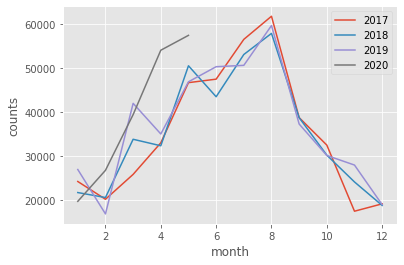
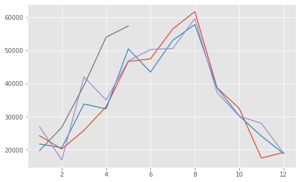
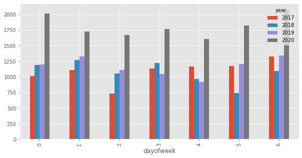
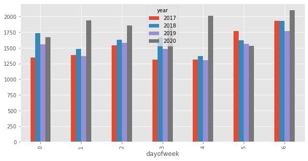
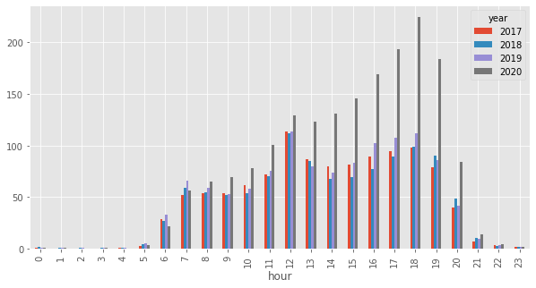
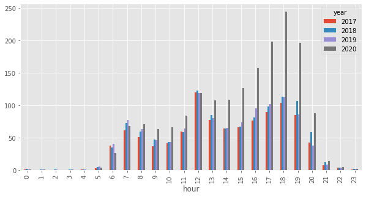
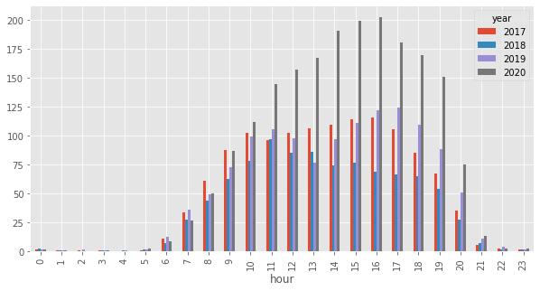

```python
import numpy as np
import pandas as pd

import matplotlib
import matplotlib.pyplot as plt

%matplotlib inline
matplotlib.style.use('ggplot')
```

### Reading data


```python
df = pd.read_csv('Elliott_Bay_Trail_in_Myrtle_Edwards_Park_Bicycle_and_Pedestrian_Counter.csv',
                              usecols=['Date','Ped South'], 
                              index_col='Date', 
                              parse_dates=True)

df=df.loc[pd.to_datetime('1/1/2017'):]
```


```python
df.shape
```


    (29928, 1)


```python
df=df.loc[~df.index.duplicated(keep='last')]
```


```python
df.isna().sum()
```


    Ped South    5
    dtype: int64


```python
df[df.isnull().any(axis=1)]
```


<div>
<style scoped>
    .dataframe tbody tr th:only-of-type {
        vertical-align: middle;
    }

    .dataframe tbody tr th {
        vertical-align: top;
    }

    .dataframe thead th {
        text-align: right;
    }
</style>
<table border="1" class="dataframe">
  <thead>
    <tr style="text-align: right;">
      <th></th>
      <th>Ped South</th>
    </tr>
    <tr>
      <th>Date</th>
      <th></th>
    </tr>
  </thead>
  <tbody>
    <tr>
      <th>2017-03-12 02:00:00</th>
      <td>NaN</td>
    </tr>
    <tr>
      <th>2018-03-11 02:00:00</th>
      <td>NaN</td>
    </tr>
    <tr>
      <th>2018-05-09 20:00:00</th>
      <td>NaN</td>
    </tr>
    <tr>
      <th>2019-03-10 02:00:00</th>
      <td>NaN</td>
    </tr>
    <tr>
      <th>2020-03-08 02:00:00</th>
      <td>NaN</td>
    </tr>
  </tbody>
</table>
</div>


```python
print('- First observation:', df.iloc[0].name)
print('- Last observation', df.iloc[-1].name)
print('- Number of observations: ', df.shape[0])
print('- Number of columns: ', df.shape[1])

```

    - First observation: 2017-01-01 00:00:00
    - Last observation 2020-05-31 23:00:00
    - Number of observations:  29928
    - Number of columns:  1


```python
df = df.fillna(method='bfill')
df=df.astype('int')
```


```python
monthly = df.resample('M', kind='period').sum()
```


```python
monthly['year']=monthly.index.year
monthly['month']=monthly.index.month
```


```python
years=list(monthly.year.unique())
```


```python
monthly.year.unique()
```


    array([2017, 2018, 2019, 2020])


```python
import matplotlib.pyplot as plt
fig,ax = plt.subplots()

for ayear in years:
    ax.plot(monthly[monthly.year==ayear].month,
            monthly[monthly.year==ayear]['Ped South'],
            label=ayear)

ax.set_xlabel("month")
ax.set_ylabel("counts")
ax.legend(loc='best')
```


    <matplotlib.legend.Legend at 0x11fedad90>





```python
monthly_pivoted = monthly.pivot(index='month', columns='year', values='Ped South')
```


```python
monthly_pivoted
```


<div>
<style scoped>
    .dataframe tbody tr th:only-of-type {
        vertical-align: middle;
    }

    .dataframe tbody tr th {
        vertical-align: top;
    }

    .dataframe thead th {
        text-align: right;
    }
</style>
<table border="1" class="dataframe">
  <thead>
    <tr style="text-align: right;">
      <th>year</th>
      <th>2017</th>
      <th>2018</th>
      <th>2019</th>
      <th>2020</th>
    </tr>
    <tr>
      <th>month</th>
      <th></th>
      <th></th>
      <th></th>
      <th></th>
    </tr>
  </thead>
  <tbody>
    <tr>
      <th>1</th>
      <td>24272.0</td>
      <td>21765.0</td>
      <td>26990.0</td>
      <td>19773.0</td>
    </tr>
    <tr>
      <th>2</th>
      <td>20243.0</td>
      <td>20636.0</td>
      <td>16921.0</td>
      <td>26807.0</td>
    </tr>
    <tr>
      <th>3</th>
      <td>25886.0</td>
      <td>33847.0</td>
      <td>41996.0</td>
      <td>39446.0</td>
    </tr>
    <tr>
      <th>4</th>
      <td>33045.0</td>
      <td>32375.0</td>
      <td>35053.0</td>
      <td>54043.0</td>
    </tr>
    <tr>
      <th>5</th>
      <td>46689.0</td>
      <td>50514.0</td>
      <td>46881.0</td>
      <td>57415.0</td>
    </tr>
    <tr>
      <th>6</th>
      <td>47481.0</td>
      <td>43493.0</td>
      <td>50303.0</td>
      <td>NaN</td>
    </tr>
    <tr>
      <th>7</th>
      <td>56503.0</td>
      <td>53072.0</td>
      <td>50614.0</td>
      <td>NaN</td>
    </tr>
    <tr>
      <th>8</th>
      <td>61748.0</td>
      <td>57858.0</td>
      <td>59638.0</td>
      <td>NaN</td>
    </tr>
    <tr>
      <th>9</th>
      <td>38759.0</td>
      <td>38742.0</td>
      <td>37305.0</td>
      <td>NaN</td>
    </tr>
    <tr>
      <th>10</th>
      <td>32527.0</td>
      <td>30253.0</td>
      <td>30175.0</td>
      <td>NaN</td>
    </tr>
    <tr>
      <th>11</th>
      <td>17535.0</td>
      <td>24171.0</td>
      <td>28002.0</td>
      <td>NaN</td>
    </tr>
    <tr>
      <th>12</th>
      <td>19208.0</td>
      <td>18847.0</td>
      <td>19021.0</td>
      <td>NaN</td>
    </tr>
  </tbody>
</table>
</div>


```python
plt.figure(figsize=(8,5));
plt.plot(monthly_pivoted, label='year')
plt.show()
```





```python
month = monthly.drop(['year','month'], axis=1, )
```


```python
daily=df.resample('D',kind='period').sum()
```


```python
daily['year']=daily.index.year
daily['month']=daily.index.month
daily['date']=daily.index.day
daily['dayofweek']=daily.index.dayofweek
daily['is_weekend']=daily['dayofweek'].isin([5, 6])
```


```python
daily
```


<div>
<style scoped>
    .dataframe tbody tr th:only-of-type {
        vertical-align: middle;
    }

    .dataframe tbody tr th {
        vertical-align: top;
    }

    .dataframe thead th {
        text-align: right;
    }
</style>
<table border="1" class="dataframe">
  <thead>
    <tr style="text-align: right;">
      <th></th>
      <th>Ped South</th>
      <th>year</th>
      <th>month</th>
      <th>date</th>
      <th>dayofweek</th>
      <th>is_weekend</th>
    </tr>
    <tr>
      <th>Date</th>
      <th></th>
      <th></th>
      <th></th>
      <th></th>
      <th></th>
      <th></th>
    </tr>
  </thead>
  <tbody>
    <tr>
      <th>2017-01-01</th>
      <td>814</td>
      <td>2017</td>
      <td>1</td>
      <td>1</td>
      <td>6</td>
      <td>True</td>
    </tr>
    <tr>
      <th>2017-01-02</th>
      <td>917</td>
      <td>2017</td>
      <td>1</td>
      <td>2</td>
      <td>0</td>
      <td>False</td>
    </tr>
    <tr>
      <th>2017-01-03</th>
      <td>722</td>
      <td>2017</td>
      <td>1</td>
      <td>3</td>
      <td>1</td>
      <td>False</td>
    </tr>
    <tr>
      <th>2017-01-04</th>
      <td>722</td>
      <td>2017</td>
      <td>1</td>
      <td>4</td>
      <td>2</td>
      <td>False</td>
    </tr>
    <tr>
      <th>2017-01-05</th>
      <td>711</td>
      <td>2017</td>
      <td>1</td>
      <td>5</td>
      <td>3</td>
      <td>False</td>
    </tr>
    <tr>
      <th>...</th>
      <td>...</td>
      <td>...</td>
      <td>...</td>
      <td>...</td>
      <td>...</td>
      <td>...</td>
    </tr>
    <tr>
      <th>2020-05-27</th>
      <td>2448</td>
      <td>2020</td>
      <td>5</td>
      <td>27</td>
      <td>2</td>
      <td>False</td>
    </tr>
    <tr>
      <th>2020-05-28</th>
      <td>2047</td>
      <td>2020</td>
      <td>5</td>
      <td>28</td>
      <td>3</td>
      <td>False</td>
    </tr>
    <tr>
      <th>2020-05-29</th>
      <td>2172</td>
      <td>2020</td>
      <td>5</td>
      <td>29</td>
      <td>4</td>
      <td>False</td>
    </tr>
    <tr>
      <th>2020-05-30</th>
      <td>598</td>
      <td>2020</td>
      <td>5</td>
      <td>30</td>
      <td>5</td>
      <td>True</td>
    </tr>
    <tr>
      <th>2020-05-31</th>
      <td>1270</td>
      <td>2020</td>
      <td>5</td>
      <td>31</td>
      <td>6</td>
      <td>True</td>
    </tr>
  </tbody>
</table>
<p>1247 rows × 6 columns</p>
</div>


```python
daily_april=daily[daily['month']==4]
```


```python
byDayOfWeek_April = pd.DataFrame(daily_april.groupby(['dayofweek','year'])['Ped South'].mean())
```


```python
# plot data
fig, ax = plt.subplots(figsize=(10,5))
# use unstack()
daily_april.groupby(['dayofweek','year']).mean()['Ped South'].unstack().plot.bar(ax=ax)
#data.groupby(['date','type']).count()['amount'].unstack().plot(ax=ax)

```


    <matplotlib.axes._subplots.AxesSubplot at 0x1196008d0>





```python
daily_may=daily[daily['month']==5]
byDayOfWeek_May = pd.DataFrame(daily_may.groupby(['dayofweek','year'])['Ped South'].mean())
```


```python
# plot data
fig, ax = plt.subplots(figsize=(10,5))
# use unstack()
daily_may.groupby(['dayofweek','year']).mean()['Ped South'].unstack().plot.bar(ax=ax)
#data.groupby(['date','type']).count()['amount'].unstack().plot(ax=ax)

```


    <matplotlib.axes._subplots.AxesSubplot at 0x11fdbe2d0>





```python
hourly=df.resample('H',kind='period').sum()
```


```python
hourly['hour']=hourly.index.hour
hourly['day']=hourly.index.day
hourly['month']=hourly.index.month
hourly['year']=hourly.index.year
hourly['is_weekend']=hourly.index.dayofweek.isin([5, 6])
```


```python
hourly_april=hourly[hourly['month']==4]
```


```python
fig, ax = plt.subplots(figsize=(10,5))
hourly_april.groupby(['hour','year']).mean()['Ped South'].unstack().plot.bar(ax=ax)
```


    <matplotlib.axes._subplots.AxesSubplot at 0x119725d90>





```python
hourly_april_weekday=hourly[(hourly['month']==4) & (hourly['is_weekend']==False)]
```


```python
fig, ax = plt.subplots(figsize=(10,5))
hourly_april_weekday.groupby(['hour','year']).mean()['Ped South'].unstack().plot.bar(ax=ax)
```


    <matplotlib.axes._subplots.AxesSubplot at 0x118e8f610>





```python
hourly_april_weekend=hourly[(hourly['month']==4) & (hourly['is_weekend']==True)]
```


```python
fig, ax = plt.subplots(figsize=(10,5))
hourly_april_weekend.groupby(['hour','year']).mean()['Ped South'].unstack().plot.bar(ax=ax)
```


    <matplotlib.axes._subplots.AxesSubplot at 0x119db5410>





```python
hourly_april
```


<div>
<style scoped>
    .dataframe tbody tr th:only-of-type {
        vertical-align: middle;
    }

    .dataframe tbody tr th {
        vertical-align: top;
    }

    .dataframe thead th {
        text-align: right;
    }
</style>
<table border="1" class="dataframe">
  <thead>
    <tr style="text-align: right;">
      <th></th>
      <th>Ped South</th>
      <th>hour</th>
      <th>day</th>
      <th>month</th>
      <th>year</th>
      <th>is_weekend</th>
    </tr>
    <tr>
      <th>Date</th>
      <th></th>
      <th></th>
      <th></th>
      <th></th>
      <th></th>
      <th></th>
    </tr>
  </thead>
  <tbody>
    <tr>
      <th>2017-04-01 00:00</th>
      <td>1</td>
      <td>0</td>
      <td>1</td>
      <td>4</td>
      <td>2017</td>
      <td>True</td>
    </tr>
    <tr>
      <th>2017-04-01 01:00</th>
      <td>0</td>
      <td>1</td>
      <td>1</td>
      <td>4</td>
      <td>2017</td>
      <td>True</td>
    </tr>
    <tr>
      <th>2017-04-01 02:00</th>
      <td>0</td>
      <td>2</td>
      <td>1</td>
      <td>4</td>
      <td>2017</td>
      <td>True</td>
    </tr>
    <tr>
      <th>2017-04-01 03:00</th>
      <td>1</td>
      <td>3</td>
      <td>1</td>
      <td>4</td>
      <td>2017</td>
      <td>True</td>
    </tr>
    <tr>
      <th>2017-04-01 04:00</th>
      <td>1</td>
      <td>4</td>
      <td>1</td>
      <td>4</td>
      <td>2017</td>
      <td>True</td>
    </tr>
    <tr>
      <th>...</th>
      <td>...</td>
      <td>...</td>
      <td>...</td>
      <td>...</td>
      <td>...</td>
      <td>...</td>
    </tr>
    <tr>
      <th>2020-04-30 19:00</th>
      <td>195</td>
      <td>19</td>
      <td>30</td>
      <td>4</td>
      <td>2020</td>
      <td>False</td>
    </tr>
    <tr>
      <th>2020-04-30 20:00</th>
      <td>116</td>
      <td>20</td>
      <td>30</td>
      <td>4</td>
      <td>2020</td>
      <td>False</td>
    </tr>
    <tr>
      <th>2020-04-30 21:00</th>
      <td>19</td>
      <td>21</td>
      <td>30</td>
      <td>4</td>
      <td>2020</td>
      <td>False</td>
    </tr>
    <tr>
      <th>2020-04-30 22:00</th>
      <td>5</td>
      <td>22</td>
      <td>30</td>
      <td>4</td>
      <td>2020</td>
      <td>False</td>
    </tr>
    <tr>
      <th>2020-04-30 23:00</th>
      <td>0</td>
      <td>23</td>
      <td>30</td>
      <td>4</td>
      <td>2020</td>
      <td>False</td>
    </tr>
  </tbody>
</table>
<p>2880 rows × 6 columns</p>
</div>


```python

```


```python
weather_df = pd.read_csv('seattle-weather.csv', 
                       parse_dates=True, 
                       index_col='Date', 
                       usecols=['Date','MaxTemp','MinTemp','Precipitation'])
```


```python
weather_df.index=weather_df.index.to_period()
```


```python
data_df = pd.merge(daily,weather_df, how='inner',left_index=True, right_index=True)
```


```python
data_df
```


<div>
<style scoped>
    .dataframe tbody tr th:only-of-type {
        vertical-align: middle;
    }

    .dataframe tbody tr th {
        vertical-align: top;
    }

    .dataframe thead th {
        text-align: right;
    }
</style>
<table border="1" class="dataframe">
  <thead>
    <tr style="text-align: right;">
      <th></th>
      <th>Ped South</th>
      <th>year</th>
      <th>month</th>
      <th>date</th>
      <th>dayofweek</th>
      <th>is_weekend</th>
      <th>MaxTemp</th>
      <th>MinTemp</th>
      <th>Precipitation</th>
    </tr>
    <tr>
      <th>Date</th>
      <th></th>
      <th></th>
      <th></th>
      <th></th>
      <th></th>
      <th></th>
      <th></th>
      <th></th>
      <th></th>
    </tr>
  </thead>
  <tbody>
    <tr>
      <th>2017-01-01</th>
      <td>814</td>
      <td>2017</td>
      <td>1</td>
      <td>1</td>
      <td>6</td>
      <td>True</td>
      <td>37</td>
      <td>28</td>
      <td>0.43</td>
    </tr>
    <tr>
      <th>2017-01-02</th>
      <td>917</td>
      <td>2017</td>
      <td>1</td>
      <td>2</td>
      <td>0</td>
      <td>False</td>
      <td>34</td>
      <td>26</td>
      <td>0</td>
    </tr>
    <tr>
      <th>2017-01-03</th>
      <td>722</td>
      <td>2017</td>
      <td>1</td>
      <td>3</td>
      <td>1</td>
      <td>False</td>
      <td>33</td>
      <td>21</td>
      <td>0</td>
    </tr>
    <tr>
      <th>2017-01-04</th>
      <td>722</td>
      <td>2017</td>
      <td>1</td>
      <td>4</td>
      <td>2</td>
      <td>False</td>
      <td>36</td>
      <td>22</td>
      <td>0</td>
    </tr>
    <tr>
      <th>2017-01-05</th>
      <td>711</td>
      <td>2017</td>
      <td>1</td>
      <td>5</td>
      <td>3</td>
      <td>False</td>
      <td>35</td>
      <td>21</td>
      <td>0</td>
    </tr>
    <tr>
      <th>...</th>
      <td>...</td>
      <td>...</td>
      <td>...</td>
      <td>...</td>
      <td>...</td>
      <td>...</td>
      <td>...</td>
      <td>...</td>
      <td>...</td>
    </tr>
    <tr>
      <th>2020-04-26</th>
      <td>2060</td>
      <td>2020</td>
      <td>4</td>
      <td>26</td>
      <td>6</td>
      <td>True</td>
      <td>62</td>
      <td>45</td>
      <td>0.12</td>
    </tr>
    <tr>
      <th>2020-04-27</th>
      <td>1669</td>
      <td>2020</td>
      <td>4</td>
      <td>27</td>
      <td>0</td>
      <td>False</td>
      <td>63</td>
      <td>48</td>
      <td>0.09</td>
    </tr>
    <tr>
      <th>2020-04-28</th>
      <td>1590</td>
      <td>2020</td>
      <td>4</td>
      <td>28</td>
      <td>1</td>
      <td>False</td>
      <td>63</td>
      <td>45</td>
      <td>0</td>
    </tr>
    <tr>
      <th>2020-04-29</th>
      <td>1778</td>
      <td>2020</td>
      <td>4</td>
      <td>29</td>
      <td>2</td>
      <td>False</td>
      <td>70</td>
      <td>49</td>
      <td>0.04</td>
    </tr>
    <tr>
      <th>2020-04-30</th>
      <td>1612</td>
      <td>2020</td>
      <td>4</td>
      <td>30</td>
      <td>3</td>
      <td>False</td>
      <td>58</td>
      <td>47</td>
      <td>T</td>
    </tr>
  </tbody>
</table>
<p>1216 rows × 9 columns</p>
</div>


```python

```
